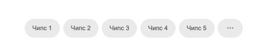
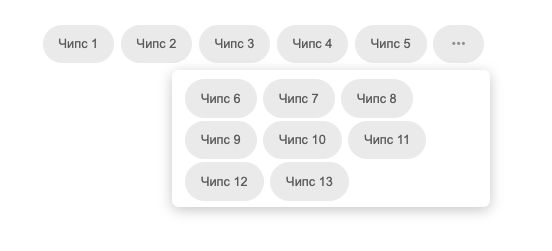

#### Задача

Необходимо реализовать компонент, отображающий список чипсов:

##### Функциональные требования

- Компонент отображает список чипов в одну строку.
- Элементы, которые не помещаются по ширине, скрываются за кнопкой `...`.
- По клику на кнопку `...` открывается попап со скрытыми элементами.
- Список адаптируется к изменению ширины экрана.
- Поддерживается выбор чипа по клику.
- `CustomChip` можно использовать отдельно от списка.
- `ChipList` построен как переиспользуемый компонент.

##### Пример




##### Технические требования

- Использование TypeScript.
- Использование React.
- Сторонние библиотеки применяются только для отображения попапа.

---

#### Реализация

1. Реализован переиспользуемый `CustomChip`, который поддерживает `variant`, `selected`, `clickable`, `disabled` и может использоваться отдельно от списка.
2. Реализован `ChipList`, который отображает чипы в одну строку, управляет выбором активного элемента и скрывает переполнение за кнопкой `...`.
3. Логика вычисления количества видимых чипов вынесена в хук `useVisibleChipCount`.
4. Для измерения реальной ширины чипов используется скрытый технический слой `ChipListMeasurement`.
5. Попап со скрытыми элементами инкапсулирован в `CustomPopover`.
6. Для демонстрации состояний добавлены переключатели `variant`, `clickable`, `status` и `WidthSwitcher`.
7. Demo-state и подготовка данных для страницы вынесены в `useChipList`, а сборка demo-экрана - в отдельную страницу `ChipListDemoPage`.

#### Используемый стек

- Core:
  - React 19
  - TypeScript
  - Vite
- UI:
  - Tailwind CSS
  - SCSS
  - MUI (`Popover`)
- Utility:
  - `clsx`
- Tooling:
  - ESLint
  - Prettier
  - TypeScript (`tsc --noEmit`)

#### Структура проекта

```text
.
├── public                            // Публичные статические файлы
├── reference                         // Материалы тестового задания
│   └── test-task.md                  // Описание ТЗ
├── src
│   ├── app                           // App-уровень и общие app-хуки
│   │   ├── App.tsx                   // Корневой компонент приложения
│   │   ├── hooks                     // Хуки для demo-логики страницы
│   │   └── types                     // Общие типы приложения
│   ├── pages                         // Страницы приложения
│   │   └── chip-list-demo-page       // Demo-страница со списком чипсов
│   ├── shared                        // Переиспользуемые данные и UI-компоненты
│   │   ├── data                      // Тестовые данные чипов
│   │   └── ui
│   │       ├── custom-button         // Универсальная кнопка-переключатель
│   │       ├── custom-chip           // Переиспользуемый чип
│   │       ├── custom-popover        // Обертка над MUI Popover и хук
│   │       └── width-switcher        // Переключатель ширины контейнера
│   ├── styles                        // Глобальные стили SCSS
│   ├── widgets                       // Крупные UI-блоки страницы
│   │   ├── chip-list                 // Список чипов и его внутренняя логика
│   │   │   ├── lib                   // Хуки виджета
│   │   │   └── ui                    // Внутренние компоненты виджета
│   │   ├── chip-list-controls        // Переключатели demo-состояний
│   │   └── header                    // Заголовок страницы
│   └── main.tsx                      // Точка входа React-приложения
└── index.html
```

---

#### Инструкция для локального запуска

1. Клонировать репозиторий и перейти в папку проекта:

```bash
git clone git@github.com:MiggRabbid/test-task-Sirius.git
cd test-task-Sirius
```

1. Установить зависимости:

```bash
npm install
```

1. Запустить проект в режиме разработки:

```bash
npm run dev
```

1. Открыть приложение в браузере по адресу, который покажет Vite.
По умолчанию это `http://localhost:5173`. Если порт занят, Vite перейдёт на следующий свободный, обычно `http://localhost:5174`.

#### Команды

| npm-команда          | make-команда | Действие                                 |
| -------------------- | ------------ | ---------------------------------------- |
| `npm install`        | `make i`     | Установка зависимостей                   |
| `npm run dev`        | `make d`     | Локальный запуск проекта                 |
| `npm run build`      | `make b`     | Production-сборка                        |
| `npm run server`     | `make p`     | Предпросмотр production-сборки           |
| `npm run type-check` | `make tc`    | Проверка типов TypeScript                |
| `npm run lint`       | `make l`     | Запуск ESLint c автоисправлением         |
| `npm run format`     | `make f`     | Форматирование файлов через Prettier     |
| `rm -rf dist`        | `make cl`    | Очистка директории `dist`                |
| `tree -I 'node_modules\|.vscode\|dist'` | `make tr` | Вывод структуры проекта через `tree`     |
